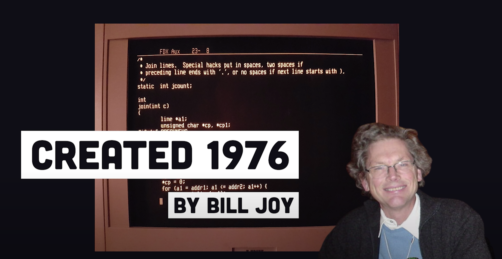
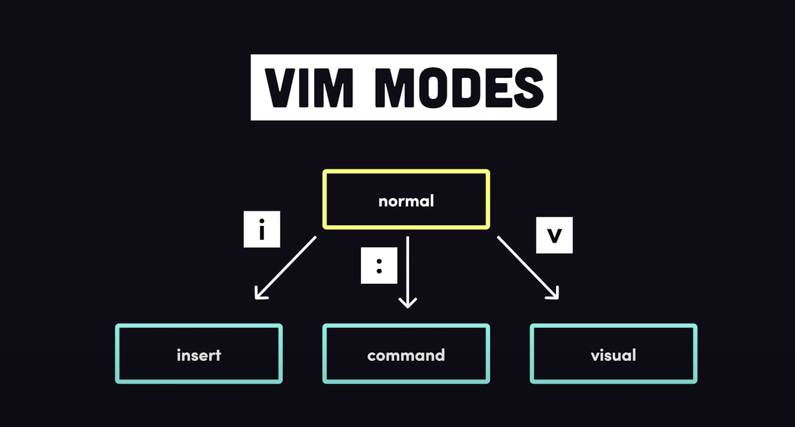

<!-- classes: title -->

## 分享

- VIM

- Tmux

≤35min

---

## VIM 历史

<!-- block-start: grid -->

<!-- block-start: column -->

vi - created 1976 - by Bill Joy

<!-- block-end -->

<!-- block-start: column -->

Vim(vi improved) - 1991 - by Bram Moolenaar

<!-- block-end -->

<!-- block-end -->

---

## Why VIM

<!-- block-start: grid -->

<!-- block-start: column -->

#### Without Mouse

- keyboard navigation

- focusing on editing and overwriting

<!-- block-end -->

<!-- block-start: column -->

#### lightweite

<!-- block-end -->

<!-- block-end -->

---

<!-- section-title: vim-mode -->

---

### command

命令模式

- 进入方式 ":"

---

### Normal

- 模式切换

- 光标导航

---

### Insert

插入模式

---

### Visual

可视模式

类型

- 行

- 块

---

<!-- section-title: Bye👋 -->

## Bye👋
